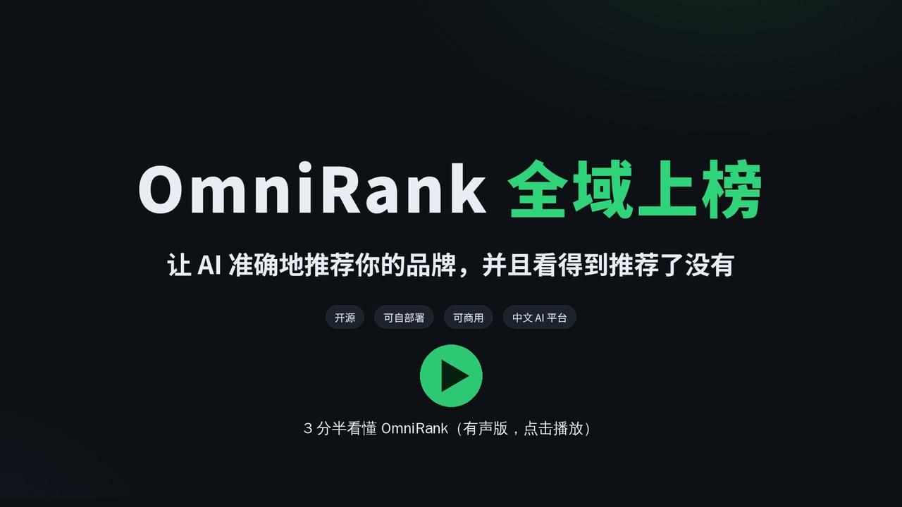

# OmniRank(全域上榜)

> **一句话:当有人问 AI「哪家好」时,帮你的品牌被 AI 准确地推荐出来,并且能看到推荐了没有。**
>
> 自己部署的网页系统:查 AI 现在怎么说你 → 写内容、发出去 → 持续盯着 AI 的回答有没有变化。

<p align="center">
  <a href="https://github.com/OmnirankGEO/Omnirank-GEO/raw/main/docs/media/omnirank-intro.mp4">
    
  </a>
  <br>
  <sub>▲ 点击观看 3 分半介绍视频(有配音):诊断、报价、创作、发布、监测、飞轮、分销、计价分别做什么、怎么运作(界面截图为演示数据)<br>想看轻松版?还有一部 2 分半像素小剧场 <a href="https://github.com/OmnirankGEO/Omnirank-GEO/raw/main/docs/media/omnirank-pixel.mp4">《王老板的 AI 上榜之旅》</a></sub>
</p>

**许可证:Apache-2.0 + 署名附加条件(非 OSI 认证的纯开源,附加条件只要求保留署名)。** 详见 [LICENSE](LICENSE)。

**License: Apache-2.0 with an attribution condition (not an OSI-approved open source license; the condition only requires keeping the attribution).** See [LICENSE](LICENSE).

项目主页:https://omnirank.cn/opensource/

---

## 这是什么

越来越多的人不再搜索,而是直接问 DeepSeek、豆包、Kimi、元宝这样的 AI:「北京哪家装修公司靠谱?」「入门级咖啡机推荐哪款?」AI 不会给十条链接让人自己挑,它会直接说出几个名字。

**没被 AI 说出名字的品牌,在这次提问里就等于不存在。** 让 AI 在回答中准确提到你,这件事叫 **GEO**(Generative Engine Optimization,生成式引擎优化),可以理解成「AI 时代的 SEO」。

OmniRank 是做 GEO 的一整套工具,装在你自己的服务器上,用浏览器打开就能用。

### 举个例子

一家做少儿编程培训的机构用 OmniRank:

1. **先体检**:系统拿家长真会问的问题(「少儿编程哪家好」「学 Scratch 还是 Python」)去问各家 AI,出一份报告:哪些问题里提到了这家机构,哪些只提了竞争对手,AI 对它的描述有没有说错。
2. **定计划**:报告挑出值得争取的问题,标出难度和预计花费。
3. **写内容**:围绕这些问题生成文章,经过事实核查和评审再定稿。
4. **发出去**:把文章投放到 AI 会读取的媒体和平台上。
5. **看效果**:之后定期再问一遍 AI,记录每一次被提到的原话和时间,能看到排名和提及的变化。

### 主要功能

| 功能 | 能帮你回答的问题 |
|---|---|
| **品牌诊断** | AI 现在怎么说我?怎么说同行?我缺了什么? |
| **报价方案** | 哪些问题值得做?难度多大?要花多少? |
| **AI 写作** | 用户真会问的问题,我该写什么内容来回答? |
| **发布投放** | 内容放到哪里,AI 才能读到? |
| **效果监测** | AI 这周有没有提到我?原话是什么?比上次好还是差? |
| **数据飞轮** | AI 更爱引用哪些来源、采纳哪种内容?下一篇怎么写更好? |
| **服务商模式** | 我是代理商 / 营销公司,能不能换上自己的品牌给客户用?(支持白标、多客户、团队协作) |

另外还有内置 AI 助手「小榜」、知识库、算力计费与钱包、订单管理、管理后台等配套功能。

**每个功能有什么用、具体怎么运作,见 [功能说明](docs/功能说明.md)。**

### 适合谁

- **想被 AI 推荐的品牌方、商家**:自己部署,自己做 GEO。
- **营销公司、代理商、SEO 服务商**:用它给多个客户提供 GEO 服务,可以商用。
- **开发者和研究者**:想研究「AI 怎么挑选推荐对象」,或者在此基础上二次开发。

### 用它需要什么

- 一台装了 Docker 的 x86_64 机器(内存 4 GB 以上,磁盘留 20 GB),按下面的[快速开始](#快速开始)操作,首次构建约十几分钟。
- 不填任何 API Key 也能启动和登录、看界面;要真正诊断、写作、监测,需要填大模型的 API Key(默认用阿里云百炼和 DeepSeek),调用费用由各服务商按量收取。
- 真实投放需要接一个发布渠道;没有渠道时可以用「模拟发布」完整演示流程。

技术栈:后端 Python(FastAPI)+ PostgreSQL + Redis,前端 React + Vite,用 Docker Compose 一键编排。界面为中文,目前主要面向中文 AI 平台。

---

## 你可以做什么,要保留什么

你可以读、部署、修改,也可以用来做生意,包括替多个客户提供服务。

在 Apache-2.0 本身的义务(随附许可证与 NOTICE、保留版权声明、标明改过的文件)之外,只多一条:部署运行、对外提供服务或再分发时,**保留界面、报告和客户页面上的 OmniRank 署名和项目主页链接**。完整条款以 [LICENSE](LICENSE) 开头的「附加条件」为准。

## 快速开始

需要:一台 Linux 机器(x86_64,内存 4 GB 以上,磁盘留 20 GB),装好 Docker 24 以上和 Docker Compose v2。要用诊断等大模型功能,还需要对应大模型服务商的 API Key(见第 2 步)。

1. 取代码,复制配置模板:

   ```bash
   git clone https://github.com/OmnirankGEO/Omnirank-GEO omnirank && cd omnirank
   cp .env.example .env
   ```

2. 编辑 `.env`。起服务、登录只要改前两项,其余保持模板默认即可:

   | 键 | 填什么 |
   |---|---|
   | `POSTGRES_PASSWORD` | 数据库口令,自己定一个长随机串 |
   | `JWT_SECRET` | 登录令牌的签名密钥,用 `openssl rand -hex 32` 生成。模板里这一行是注释,去掉行首的 `#` 再填 |
   | `PUBLIC_BASE_URL` | 对外访问地址(形如 `https://你的域名`),分享链接、发布文章里的图片都用它;只在本机试用可以不填 |
   | 大模型 Key(模板里「LLM 服务商 API Key」那一段) | 起服务和登录不需要;要用诊断等大模型功能时再填。默认配置下诊断报告用阿里云百炼(`DASHSCOPE_API_KEY`),评分用 DeepSeek(`DEEPSEEK_API_KEY`) |
   | `ADMIN_INITIAL_PASSWORD`(可选) | 初始管理员 `admin` 的口令,至少 12 位。不填的话,第 3 步建库时会随机生成一个,只在那一步的输出里打印一次 |

3. 起数据库、构建镜像、建库,再起应用和定时任务:

   ```bash
   docker compose up -d db redis
   docker compose build omnirank-blue                        # 第一次要十几分钟
   docker compose run --rm -e ROLE=prestart omnirank-blue    # 建表与迁移,跑完自己退出;首次会打印一次管理员随机口令
   docker compose up -d omnirank-blue                        # 网页与接口
   docker compose up -d omnirank-cron-blue                   # 定时任务
   docker compose ps                                         # 等 omnirank-blue 显示 healthy
   ```

   定时任务容器一定要起:监测、发布结果回写都靠它,不起的话发布单会一直停在「处理中」。它在编排文件里带了 profile,只写 `docker compose up -d` 不会起它,要像上面这样按名字单独起。

4. 浏览器打开 `http://127.0.0.1:8001`,用户名 `admin`,口令是 `.env` 里的 `ADMIN_INITIAL_PASSWORD`;没填的话,看第 3 步 prestart 那一行输出里打印的随机初始口令(只打印这一次,记下来)。首次登录会要求立刻改密码。

5. 想先试一遍发布流程:在 `.env` 里设 `PUBLISH_CHANNEL=dry_run`(模拟发布,不向任何外部地址发请求),重启应用和定时任务两个容器(`docker compose up -d omnirank-blue omnirank-cron-blue`)。

   **试之前先给账号加付费算力**:模拟发布和真实发布一样按媒体价格扣算力,而且只能用付费算力,注册赠送的不能用,不够会返回 402。管理员在后台怎么加,见[发布渠道](#发布渠道)。

   不设 `PUBLISH_CHANNEL` 时发布会被拒绝、不扣算力;接真实渠道(`api`)和模拟发布的细节,都在[发布渠道](#发布渠道)一节。

- 端口只绑在本机(127.0.0.1:8001)。要对外提供服务,请在前面加反向代理并配上 HTTPS。
- 升级代码后:先 `docker compose build omnirank-blue`,再重跑第 3 步里 prestart 那一行,然后 `docker compose up -d omnirank-blue omnirank-cron-blue`。
- 数据在 Docker 卷 `geo_agentscope_pgdata` 里。停服务用 `docker compose stop`;`docker compose down` 不会删数据,但**不要加 `-v`**(会连数据卷一起删掉)。
- 镜像构建默认走国内镜像源(阿里云 PyPI、npmmirror)。在境外构建如果很慢,改 `Dockerfile` 里的源地址。
- **对外提供服务之前**:`docs/条款/` 里的用户服务协议、隐私政策和服务商协议留着 `〔运营方全称〕`、`〔网址〕`、`〔联系邮箱〕` 等占位,请全文搜索 `〔` 换成你自己的信息。

## 用 AI 工具帮你部署

在 Codex、Claude Code、Cursor 等 AI 工具中打开本仓库，复制这句话：

> 请按照这个仓库根目录的 AGENTS.md，帮我在本机部署，并告诉我登录地址和管理员口令保存在哪。

[AGENTS.md](AGENTS.md) 包含环境检查、本机端口覆盖、资源隔离、启动步骤和登录验收；Claude Code 通过根目录 `CLAUDE.md` 引用同一份说明。

## 外部服务与 Key

按要使用的功能配置,不需要一次填齐所有外部 Key。下表的「按功能必填」只针对该服务对应的功能;启动步骤仍按上面的快速开始执行。部分模型 Key 也能在管理界面的设置中填写;缺 Key 的行为指该功能也没有其他可用凭证(如管理设置或多 Key 池)。需使用代码缺省值时,删除或注释对应行,`KEY=` 空值可能覆盖缺省值。

| 服务 | 环境变量 | 用在哪个功能 | 必填 / 可选;不配时的行为 |
|---|---|---|---|
| PostgreSQL | `POSTGRES_PASSWORD` | Compose 中数据库的初始化及应用连接 | **Compose 必填**;缺失时 Compose 直接拒绝启动 |
| 数据库连接 | `DATABASE_URL` | 建库迁移和业务数据读写 | Compose 已自动组装,不用另填;脱离 Compose 运行时必填,缺失或连接失败会使 prestart 非零退出 |
| 登录令牌签名 | `JWT_SECRET` | 账号密码登录、令牌验证 | 代码有兜底,但快速开始要求显式设置;不配时读取或生成 `data/jwt_secret.key`,文件操作失败则使用临时密钥,重启后旧令牌失效 |
| 对外访问地址 | `PUBLIC_BASE_URL` | 分享链接、文章图片绝对地址、支付回调默认地址 | 可选;不配时使用本机地址。对外访问需填自己的站点地址 |
| 阿里云百炼 / DashScope | `DASHSCOPE_API_KEY` | 默认诊断报告、通义及百炼代理模型观测、知识库嵌入 | **按功能必填**;缺失时上述模型调用或知识库初始化会报缺 Key,不影响账号密码登录 |
| DeepSeek | `DEEPSEEK_API_KEY` | 默认诊断评分、文章评审、DeepSeek 官方观测 | **按功能必填**;缺失时官方观测报缺 Key,所选写作模型显示不可用 |
| Kimi 官方接口 | `KIMI_API_KEY` | Kimi 官方诊断查询及显式选择的 Kimi 写作模型 | 可选;使用该接口时必填,不配时对应写作模型不可用、官方查询无法鉴权。百炼代理的 Kimi 观测使用 `DASHSCOPE_API_KEY` |
| OpenRouter | `OPENROUTER_API_KEY` | 显式选择的 OpenRouter 写作模型 | 可选;不配时这些模型显示不可用 |
| 硅基流动 | `SILICONFLOW_API_KEY` | 显式选择的硅基流动写作模型 | 可选;不配时这些模型显示不可用 |
| 豆包 / 火山方舟 | `DOUBAO_API_KEY`、`DOUBAO_SEED_API_KEY`、`VOLC_API_KEY`、`DOUBAO_ENDPOINT_ID` | 豆包模型调用和豆包观测 | 可选;通用写作模型用 `DOUBAO_API_KEY`,观测依次取 `VOLC_API_KEY`、Seed Key、通用 Key,全缺时报缺 Key。Seed Key 可回落通用 Key;接入点 ID 仅覆盖顾问请求的模型,不配则保留原模型名 |
| 腾讯混元 TokenHub | `HY3_API_KEY` | 元宝平台的混元模型观测 | **使用该平台时必填**;不配时该观测返回缺 Key 错误,不会静默换平台 |
| 秘塔搜索 | `METASO_API_KEY` | 网页 / 学术检索、写作证据与调研素材 | **使用秘塔时必填**;不配时请求无法鉴权,返回搜索错误 |
| 豆包搜索 | `DOUBAO_SEARCH_API_KEY` | 已切换到豆包搜索的证据采集、调研等场景 | 可选;默认仍走秘塔。未配该 Key 时路由回秘塔,豆包失败或空结果也回退秘塔;它与豆包模型 Key 分开配置 |
| Jina Reader | `JINA_API_KEY` | 调研监测中读取网页正文 | 可选;不配时仍发送匿名 Reader 请求,不带鉴权头 |
| 5118 | `API_5118_LONGTAIL_KEY`、`API_5118_SEARCH_VOLUME_KEY` | 长尾词挖掘、搜索量查询 | **调用对应接口时必填**,两项分别用于不同接口;不配时对应请求无法鉴权,不返回成功的关键词数据 |
| 火山引擎语音识别 | `VOLCENGINE_ASR_APP_KEY`、`VOLCENGINE_ASR_ACCESS_KEY` | 音频转录 / 流式语音识别 | 可选;使用此 ASR 时两项都需要,不配时返回未配置凭证状态或错误,没有该路的转录文本 |
| 图片生成 API | `APIMART_API_KEY`、`MARKETING_APIMART_KEY` | 推广素材中的 AI 生图 | 可选;优先取前者,后者为兼容别名,不配时不提交生图任务,任务接口返回缺 Key 拒绝 |
| 图片生成接口覆盖 | `MARKETING_IMAGE_GENERATION_URL`、`MARKETING_IMAGE_TASK_URL` | 生图任务提交和状态查询 | 可选;不配时使用代码内置接口。覆盖地址需兼容现有请求 / 响应格式,任务地址模板保留 `{task_id}` |
| 发布渠道 API | `PUBLISH_CHANNEL`、`PUBLISH_CHANNEL_API_BASE`、`PUBLISH_CHANNEL_API_KEY` | 真实软文发布或模拟发布 | 可选;不设渠道则拒绝发布。`dry_run` 无需地址和 Key;`api` 必须同时配置地址和 Key,缺一项按未接入处理,细节见下节 |
| 发布渠道回调 | `PUBLISH_CHANNEL_CALLBACK_SECRET` | 兼容发布结果回调入口的共享密钥校验 | 可选;只在使用该回调入口时配置。环境变量未配时读取管理设置,两处都没有或校验失败时入口返回 404 |
| 阿里云短信 | `ALIBABA_CLOUD_ACCESS_KEY_ID`、`ALIBABA_CLOUD_ACCESS_KEY_SECRET`、`SMS_SIGN_NAME` | 手机验证码与组织邀请短信 | **启用短信时需要有效 AccessKey 和自己的短信签名**;缺 AccessKey 时客户端初始化报错,签名未配时请求传入空签名;账号密码登录不依赖短信 |
| 手机验证码模板 | `SMS_TEMPLATE_CODE`、`SMS_TEMPLATE_FALLBACK` | 注册 / 登录验证码短信的主模板与备用模板 | 可选覆盖项;不配时使用代码预设模板。自建需换成自己账号可用的模板,两个模板都发送失败时返回短信不可用 |
| 组织邀请短信 | `ORGANIZATION_INVITE_DELIVERY_PROVIDER`、`SMS_TEMPLATE_INVITE`、`SMS_TEMPLATE_INVITE_LINK`、`ORGANIZATION_INVITE_LINK_BASE_URL` | 邀请验证码及邀请链接送达 | 可选;送达默认 `disabled`,请求返回 503;真实短信送达设为 `aliyun_sms`,还需上面的短信凭证。验证码缺模板会拒绝发送;邀请链接缺模板或公开链接前缀时返回配置缺失 |
| 组织邀请密钥 | `ORGANIZATION_INVITE_HMAC_KEYS`、`ORGANIZATION_INVITE_ENCRYPTION_KEYS`、`ORGANIZATION_TOKEN_HMAC_KEYS` | 邀请目标摘要、送达内容加密、邀请令牌摘要 | **启用邀请时必填**;每项使用 `版本:base64密钥` 格式,多版本用逗号隔开,缺失或格式错误时邀请功能返回 503 |
| 组织邀请密钥版本 | `ORGANIZATION_INVITE_HMAC_KEYS_ACTIVE_VERSION`、`ORGANIZATION_INVITE_ENCRYPTION_KEYS_ACTIVE_VERSION`、`ORGANIZATION_TOKEN_HMAC_KEYS_ACTIVE_VERSION` | 选择上述三组密钥各自的当前版本 | **启用邀请时必填**;代码动态读取对应版本变量,未配或指定版本不在密钥组内时返回 503 |
| 微信支付 | `WX_MCH_ID`、`WX_APPID`、`WX_SERIAL_NO`、`WX_APIV3_KEY`、`WX_PUB_KEY_ID` | 微信支付商户请求、回调解密及验签 | **接微信支付时必填**;未配置完整商户参数和密钥文件时支付 / 回调处理不可用,其余功能不要求配置 |
| 微信支付密钥文件 | `WX_KEY_PATH`、`WX_PUB_KEY_PATH` | 加载商户私钥与平台公钥 | 可选路径覆盖项;不配时尝试默认文件位置。有效文件本身必需,找不到会报错 |
| 微信 JSAPI | `WX_APP_SECRET` | 微信内支付前获取用户 OpenID | **使用 JSAPI 时必填**;缺失时获取 OpenID 报错,不用于普通 Native 扫码支付 |
| 微信支付回调地址 | `WX_NOTIFY_URL`、`WX_REFUND_NOTIFY_URL` | 支付与退款结果通知 | 可选;不配时由 `PUBLIC_BASE_URL` 和对应回调路径生成 |
| 扫码支付网关 | `XUNHUPAY_APPID`、`XUNHUPAY_APPSECRET` | 另一条扫码支付通道及退款 | **使用该通道时必填**;缺失时创建支付 / 退款请求报未配置错误 |
| 扫码支付网关地址 | `XUNHUPAY_GATEWAY`、`XUNHUPAY_NOTIFY_URL`、`XUNHUPAY_RETURN_URL` | 支付网关、异步通知和支付后返回页面 | 可选;网关未配时使用内置接口,通知 / 返回地址未配时由 `PUBLIC_BASE_URL` 和固定路径生成 |
| 阿里云 OSS 凭证 | `OSS_ACCESS_KEY_ID`、`OSS_ACCESS_KEY_SECRET` | 实名资料、反馈截图、发布证据和调研正文的对象存储 | **使用这些 OSS 功能时必填**;缺失时初始化存储客户端报配置错误,不是启动应用的前置条件 |
| 实名资料存储与加密 | `OSS_KYC_BUCKET`、`OSS_KYC_ENDPOINT`、`KYC_ENCRYPT_KEY`、`KYC_HMAC_KEY` | 实名照片存储、证件号加密和摘要 | Bucket / Endpoint 可覆盖代码默认值,自建填写自己的资源;加密 / HMAC Key 是对应实名操作必填项,各为 base64 编码的 32 字节密钥,缺失或无效时报配置错误 |
| 反馈截图存储 | `OSS_FEEDBACK_BUCKET`、`OSS_FEEDBACK_ENDPOINT` | 问题反馈截图上传和访问 | 可选;Bucket 未配时回落实名 Bucket,Endpoint 未配时依次回落实名 Endpoint、内置地域。反馈和实名 Bucket 都未配则不能上传 |
| 发布证据存储 | `OSS_PUBLISH_BUCKET`、`OSS_PUBLISH_ENDPOINT` | 发布结果截图 / 证据上传 | 可选覆盖项;不配时使用代码默认 Bucket / Endpoint,自建填写自己创建的资源,上传还需 OSS 凭证 |
| 调研正文存储 | `OSS_RESEARCH_ARTICLES_BUCKET`、`OSS_RESEARCH_ARTICLES_ENDPOINT` | 调研监测采集的文章正文存取 | 可选覆盖项;不配时使用代码默认 Bucket / Endpoint,自建填写自己创建的资源,存取还需 OSS 凭证 |

其余为可选的调优项,见 `.env.example` 注释。

## 发布渠道

发布用哪条渠道,只看 `.env` 里的 `PUBLISH_CHANNEL`,有三种状态:

| `PUBLISH_CHANNEL` | 发布时会怎样 | 适合 |
|---|---|---|
| 不设(默认) | 提示「发布渠道未接入,接入后才能发布。」;不扣算力、不生成发布任务、不向外发任何请求 | 只用诊断、报价、写作、监测 |
| `dry_run` | **模拟发布**:下单、扣算力、等待、出结果,整条流程照常走完;媒体列表里是名字带「(演示)」的演示媒体,结果链接不是真链接;在途的单可以撤,撤单原额退回算力。全程不访问任何外部地址 | 试用、演示、培训 |
| `api` | 接入一个兼容本项目公开契约 v1 的**发布渠道 API**,真实投放。这一版只接软文 | 正式使用 |

`api` 模式还要同时配两项,缺一项就按「没接入」处理:

- `PUBLISH_CHANNEL_API_BASE`:发布渠道 API 的服务地址,**填到 `/v1` 这一层**(形如 `https://<服务地址>/v1`);
- `PUBLISH_CHANNEL_API_KEY`:在发布渠道的控制台申请的 API Key。只放在服务器的 `.env` 里,不要提交进代码仓库。

改完 `.env` 后重启应用和定时任务两个容器(`docker compose up -d omnirank-blue omnirank-cron-blue`)。发布结果由定时任务回写,定时任务没起来,单会一直停在处理中。

- 模拟发布和真实发布一样按媒体价格扣算力,而且**只能用付费算力,注册赠送的算力不能用**;付费算力不够时,发布会返回 402 `INSUFFICIENT_PAID_POINTS`。试用时,管理员可以在后台「用户管理 → 打开该用户 → 钱包与账单 → 校正算力」里,选「付费算力」给账号增加(会留下操作人与原因的记录)。演示媒体的价格只是示例值。
- 这一版 `api` 模式只接软文;自媒体图文与短视频会提示「发布渠道这一版只接软文」。
- 不打算用现成的发布渠道 API,也可以自己写:在 `services/publish_channels/` 里照 `dry_run.py` 的那组方法实现一个客户端,再在同目录 `__init__.py` 的 `get_client()` 里接上它。

## 管理员手册

有几项管理操作没有前端页面,只能通过 API 完成,见 [docs/admin-manual.md](docs/admin-manual.md)。

## 参与贡献

欢迎提交 issue 和 pull request。每个 commit 需要带 `Signed-off-by:`(DCO),见 [CONTRIBUTING.md](CONTRIBUTING.md)。

## 名称与标识

「OmniRank」「全域上榜」名称与 logo 的使用说明见 [TRADEMARK.md](TRADEMARK.md)。

## 联系与反馈

- **使用问题和建议**:请在本仓库的 [Issues](https://github.com/OmnirankGEO/Omnirank-GEO/issues) 里提。提之前先搜一下,看看有没有人提过同样的问题。
- **安全漏洞请不要公开提 Issue。** 请走 GitHub 的私下报告:打开本仓库的 **Security** 页,点 **Report a vulnerability**([直达](https://github.com/OmnirankGEO/Omnirank-GEO/security/advisories/new))。报告只有维护者能看到。

---

© 2026 全域上榜（深圳）科技有限公司 · 第三方组件的许可证见 [NOTICE](NOTICE)
